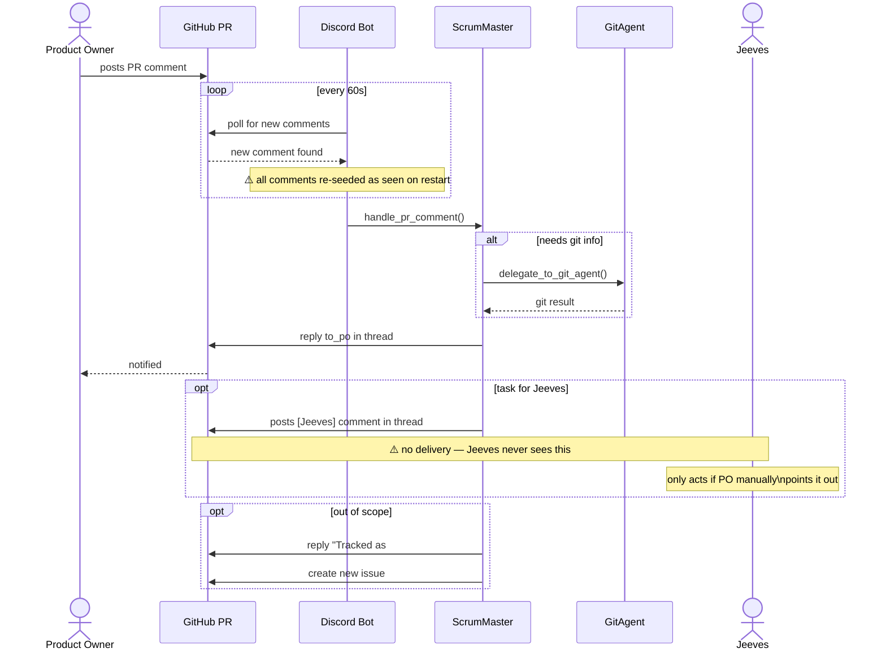
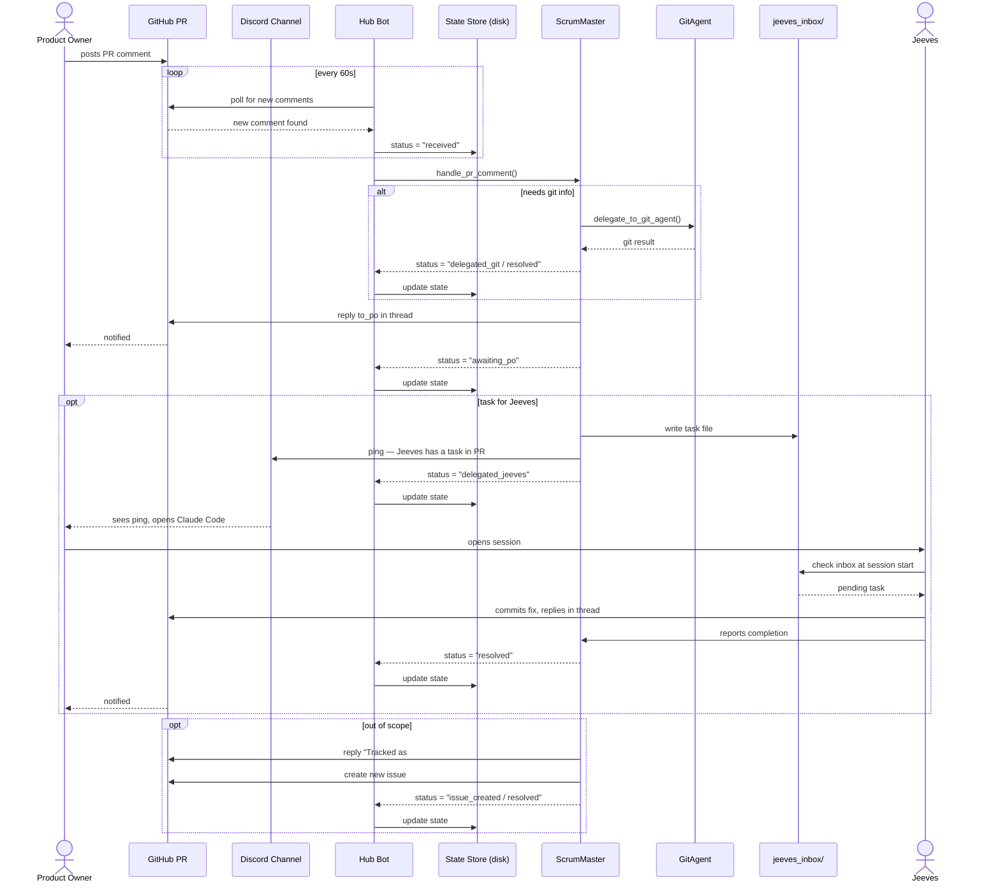

# Agent Communication — Use Case Diagram


## Current state



## Proposed state



## Communication paths

| From | To | Mechanism | Reliable? |
|---|---|---|---|
| Product Owner | ScrumMaster | PR comment → bot poll | ✓ (with state persistence) |
| Product Owner | ScrumMaster | Discord message → bot | ✓ |
| ScrumMaster | Product Owner | PR comment reply (to_po) | ✓ |
| ScrumMaster | GitAgent | In-process tool use | ✓ |
| ScrumMaster | Jeeves | `jeeves_inbox/` file + Discord ping | ✓ |
| ScrumMaster | Hub Bot | Status report (after each action) | ✓ |
| GitAgent | ScrumMaster | Return value from tool call | ✓ |
| Jeeves | ScrumMaster | Report completion via PR comment | ✓ |
| Hub Bot | State Store | Sole writer — reads and writes on every status change | ✓ (atomic writes) |

## State store ownership

Hub Bot is the **sole writer** of `bot/state/comment_state_PR[ID].json`. No agent writes to it directly.

Agents report status changes up the chain:

```
Jeeves → ScrumMaster → Hub Bot → State Store
```

This eliminates concurrent write risk and makes Hub Bot the single source of truth for all comment and delegation state.

### Comment status lifecycle

Each comment in the state store has a `status` field updated exclusively by Hub Bot:

| status | set when |
|---|---|
| `new` | Hub Bot first sees the comment |
| `delegated_to_scrum_master` | Hub Bot forwards the comment to ScrumMaster |
| `pending` | ScrumMaster reports back that it has created a delegation — work is ongoing |
| `resolved` | Hub Bot derives this when all delegation items on the comment are `resolved` or `superseded` |

When a comment has no delegations, Hub Bot sets `resolved_by` to the ID of the comment that constitutes the resolution (e.g. the ScrumMaster reply). Comments that are themselves responses (ScrumMaster replies, Jeeves completions) are marked `resolved` immediately when posted — they require no further action.

Thread `status` is also derived: Hub Bot sets it to `resolved` when all comments in the thread are `resolved`.

### Delegation status lifecycle

Each delegation item has a unique `id` and its own `status`, updated exclusively by Hub Bot on behalf of the reporting agent. Agents always include the comment ID and delegation ID when reporting back so Hub Bot knows exactly what to update.

| status | set when |
|---|---|
| `pending` | ScrumMaster reports the delegation was created |
| `in_progress` | Jeeves reports to ScrumMaster that work has started; ScrumMaster relays to Hub Bot |
| `resolved` | Jeeves reports completion with commit SHA; ScrumMaster relays to Hub Bot |
| `superseded` | A later re-delegation replaces this one |

## Proposed improvements

1. **Rename Discord Bot → Hub Bot** — reflects that it polls both Discord and GitHub
2. **Persistent state store** — replace in-memory `_seen` set with `bot/state/comment_state_PR[ID].json`, tracking per-comment and per-delegation status
3. **Hub Bot as sole writer** — all agents report status up the chain; Hub Bot is the only process that writes to the state store
4. **`jeeves_inbox/`** — ScrumMaster writes task files; Jeeves checks at session start
5. **Discord ping on Jeeves delegation** — notifies PO to open Claude Code
