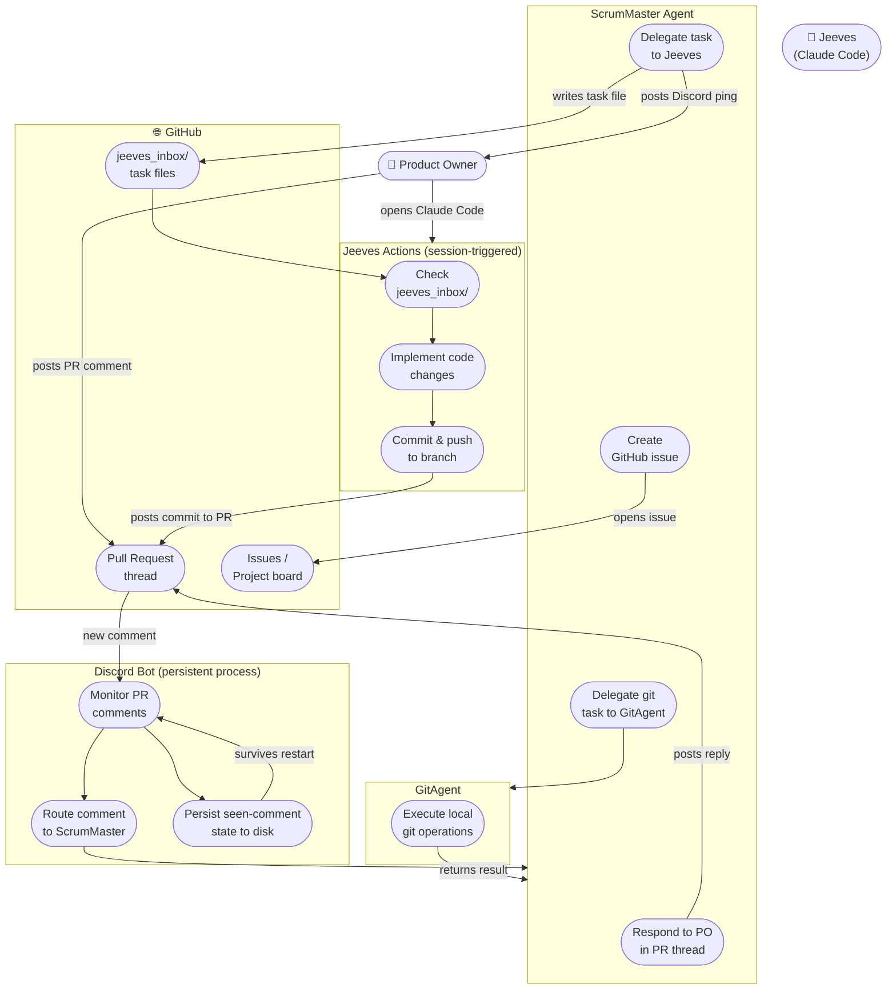
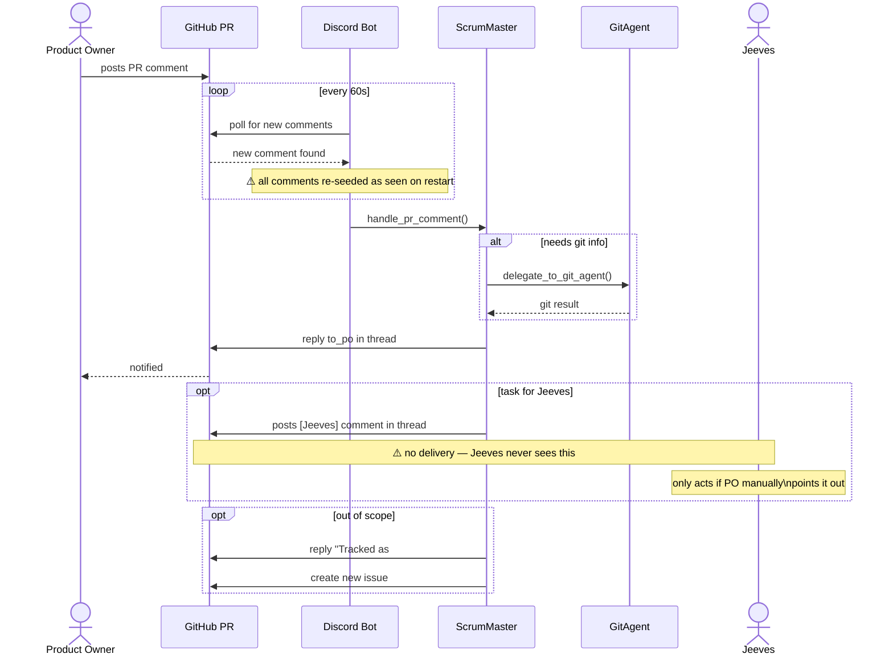
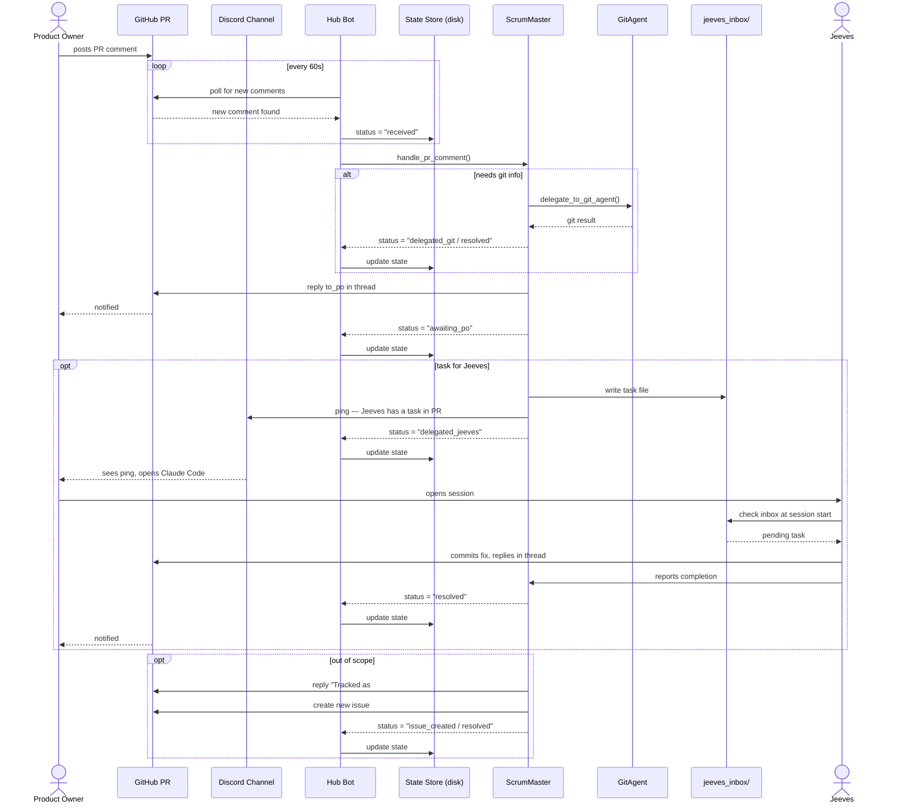

# Agent Communication — Use Case Diagram

## Current state

## Proposed state

## Communication paths

| From | To | Mechanism | Reliable? |
|---|---|---|---|
| Product Owner | ScrumMaster | PR comment → bot poll | ✓ (with state persistence) |
| Product Owner | ScrumMaster | Discord message → bot | ✓ |
| ScrumMaster | Product Owner | PR comment reply (to_po) | ✓ |
| ScrumMaster | GitAgent | In-process tool use | ✓ |
| ScrumMaster | Jeeves | `jeeves_inbox/` file + Discord ping | ✓ |
| ScrumMaster | Hub Bot | Status report (after each action) | ✓ |
| GitAgent | ScrumMaster | Return value from tool call | ✓ |
| Jeeves | ScrumMaster | Report completion via PR comment | ✓ |
| Hub Bot | State Store | Read/write on every status change | ✓ (atomic writes) |

## Proposed improvements

1. **Rename Discord Bot → Hub Bot** — reflects that it polls both Discord and GitHub
2. **Persistent state store** — replace in-memory `_seen` set with a disk-backed store tracking full comment status (`received`, `delegated_jeeves`, `delegated_git`, `awaiting_po`, `issue_created`, `resolved`)
3. **`jeeves_inbox/`** — ScrumMaster writes task files; Jeeves checks at session start
4. **Discord ping on Jeeves delegation** — notifies PO to open Claude Code
5. **ScrumMaster reports status back to bot** — bot is the single owner of state; agents report up the chain
